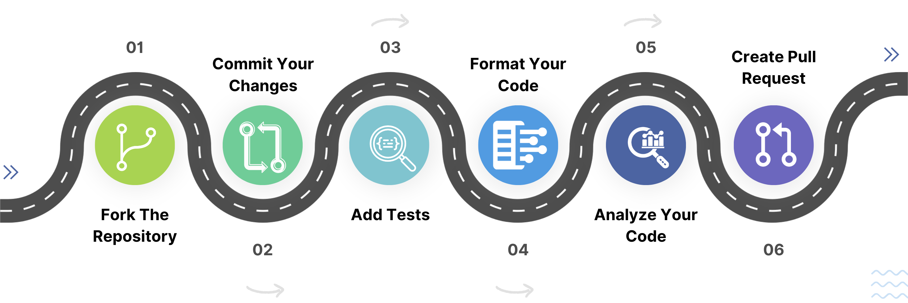

# Contributing to Vania

## :sparkles: Creating a Pull Request

Before creating a pull request, please follow these steps:

1. **Fork the Repository** 🍴
   - Fork the repository and create your branch from `dev`.

2. **Install Dependencies** 📦
   - Run `dart pub get` to install all dependencies.

3. **Commit your Changes** ✅
   - Squash your commits and ensure you have a meaningful, [semantic commit message](https://www.conventionalcommits.org/en/v1.0.0/).

4. **Add Tests** 🔍
   - Add tests! Pull Requests without 100% test coverage will not be approved.

5. **Test Suite** ✔️
   - Ensure the existing test suite passes locally.

6. **Format Your Code** 🎨
   - Format your code with `dart format .`.

7. **Analyze Your Code** 🕵️
   - Analyze your code with `dart analyze --fatal-infos --fatal-warnings .`.

8. **Create the Pull Request** 🚀
   - Create the Pull Request targeting the `dev` branch.

9. **Status Checks** 📝
   - Verify that all status checks are passing.

**Thank you for contributing!** :heart: We appreciate your efforts to improve Vania.

